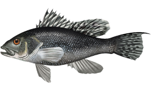
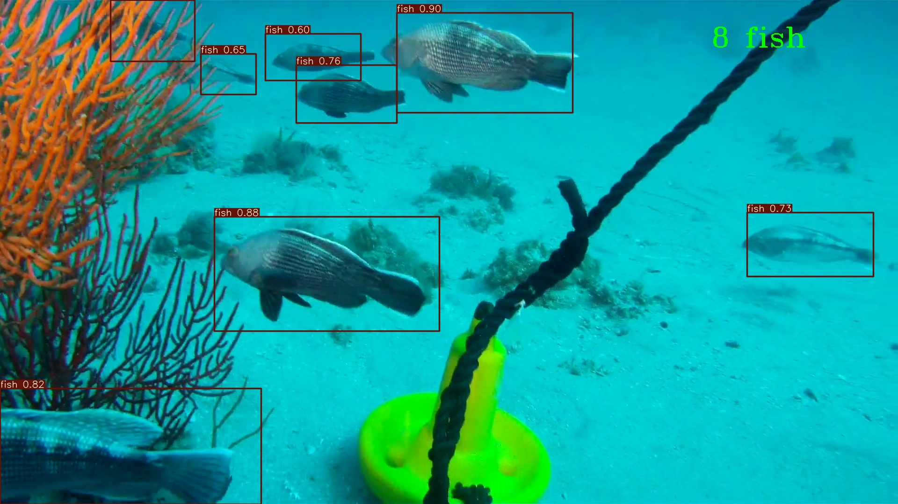
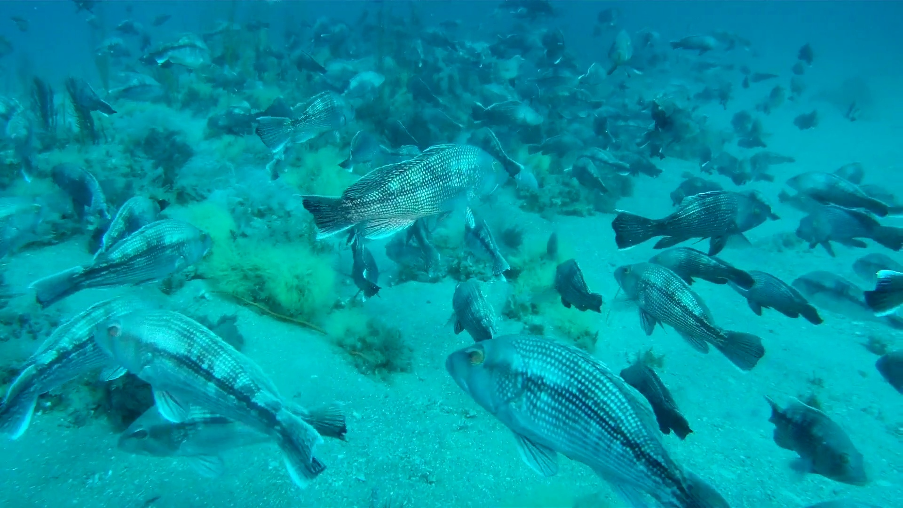
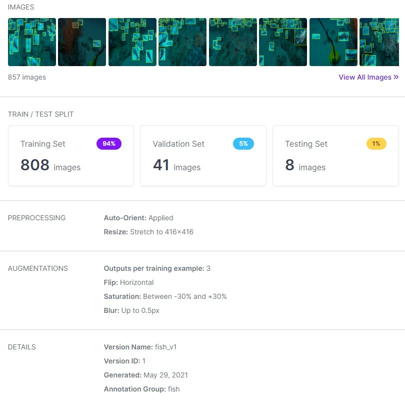
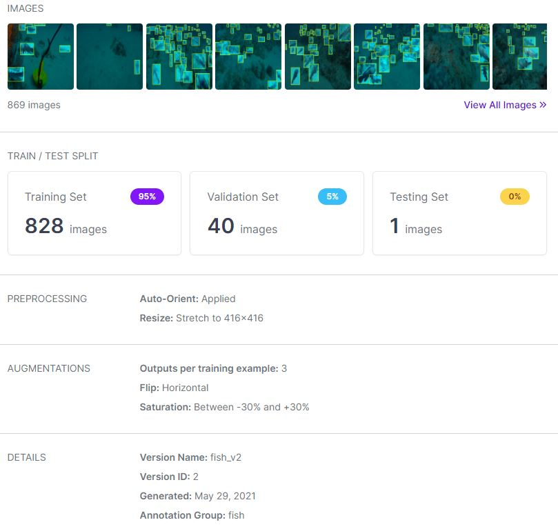

# Fish_Detection_Counter_YOLOv5L

Photo from fisheries.noaa.gov

On this repository, I want to share my work; detection of the Black Sea Bass (Centropristis Striata) Fish Species and estimation the number of fish on each frame for [the 2021 Machine Learning MATE ROV Microsoft Azure Computer Coding Challenge Task 2](http://files.materovcompetition.org/2021/Computer_Coding_Challenge_Round_2.pdf).

# Summary
- The Dataset is created by using [Roboflow](https://app.roboflow.com).
- YOLOv5l is used for detection on the Custom Dataset that is labeled by me and Emre Er.
- Fish detection is performed on [the video stream](https://vimeo.com/515388373/99dee8df99) that is provided by the Gray’s Reef National Marine Sanctuary.
- Number of detected fish is displayed on the right top corner of each frame

# Table of Contents

1. About the Competition
2. About the Model and the Data
3. How to Detect Yourself?
4. My Observations About the Task
5. Discussion

# 1. About the Competition

Me and my friends, as [DEU ROV TEAM](https://www.instagram.com/deurov.team/), attend to [the 2021 Machine Learning MATE ROV Microsoft Azure Computer Coding Challenge!](https://www.materovcompetition.org/content/2021-machine-learning-computer-coding-challenge)

**The Mission:** It is cumbersome to do fish counts from video transects. Start with pre-built Artificial Intelligence models like Microsoft Computer Vision and Video Indexer OR take it to the next level by building your own machine learning (aka coding) models.

**Task 2:** Address this issue by harnessing the power of cloud computing, machine learning/artificial intelligence, and image recognition/processing. Create a program that counts how many fish are seen at any one instant during a video transect.

**Video transect:** [Computer Coding Challenge Round #2](https://vimeo.com/515388373/99dee8df99) video from m the Gray’s Reef National Marine Sanctuary. Video courtesy of diver/videographer Randy Rudd.

# 2. About the Model and the Data

To be able to detect Fish, the data is collected from the Video frame by frame but only 0th, 10th and 20th frames are extracted for each second to create a dataset with about 300 images. 

The dataset is labeled and splitted as Train, Validate and Test.

**Original version:** TRAIN 270, VALID 41, TEST 8

**Preprocessing:** Resize 416x416

**Augmented version:** Flip Horizontal, Saturation Between -30% and +30%, Blur Up to 0.5px, TRAIN(808 images, 94%) VALID(41 images, 5%) TEST(8 images, 1%)

Then, another dataset version is also created by rebalancing the dataset and changing the augmentation process. This time the rates were as 95%(828 images), 5%(40 images) and 0%(1 images) respectively but the performance did not change dramatically.

Then, [YOLOv5 tutorial of Ultralytics](https://github.com/ultralytics/yolov5/blob/master/tutorial.ipynb) and [Custom Dataset application tutorial of RoboFlow](https://blog.roboflow.com/how-to-train-yolov5-on-a-custom-dataset/) are followed to use [YOLOv5l model](https://github.com/OnurcanKoken/Crab_Detection_YOLOv5L/blob/main/yolov5l.yaml) for the detection of the crabs.
Also you can check the research paper of [You Only Look Once (YOLO)](https://arxiv.org/pdf/1506.02640.pdf).

Additionally, it was necessary to display number of fish. Therefore, another variable is inserted into `detect.py` file and putText is used, then the python file is saved as `detect_fish.py`.

Original `detect.py` is performed for training and the modified version `detect_fish.py` is performed to display counted fish number at the "Instead of Test Set" part.

# 3. How to Detect Yourself?

You can simply follow [my colab tutorial](https://colab.research.google.com/github/OnurcanKoken/Fish_Counter_YOLOv5L/blob/main/Fish_Detection_Counter_Colab_YOLOv5/Fish_Detection_Counter_Colab_YOLOv5.ipynb) which was explained in detail.

- Download original YOLOv5 repository and extract the files - Install Dependencies
- Download the custom dataset
- Define Model Configuration and Architecture
  
Important! You need to replace and use my [`detect.py` file](Python_Files/detect_fish.py), after training and testing, to display number of fish by yourself!

Besides, I have preferred to use large one instead of s, m or x. You can use any of these as you wish. [TIP](Python_Files/hubconf.py)

- Train Custom Yolov5 Detector
- Evaluate Custom Yolov5 Detector Performance
- Run Inference With Trained Weights
- Export Trained Weights for Future Inference
- Instead of Test Set (Use Individual Images or Videos)

# 4. My Observations About the Task

It was quite fun and I have learned a lot by this project. This was my second time to use YOLO in a project like this one. The task was extremely challenging since the number of fish was above 50 at some parts and it was so hard to distinguish any fish that are small and at the background. However, the performance was quite enough for using only around 300 labeled images. The accuracy of detection can be improved by labeling more images and training longer without overfitting. I am so glad to complete this task.

# 5. Discussion

If you have any question and suggestion, please do not hesitate to contact me.

# Thanks!

Onurcan Köken
30th of May, 2021
