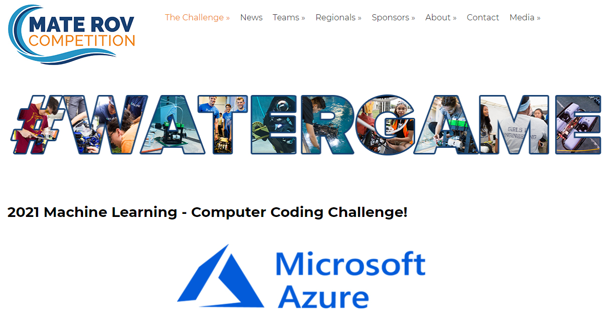

# Crab_Detection_YOLOv5L

On this repository, I want to share my work; detection of Chionoecetes Tanneri Crabs and estimation of their lengths for [the 2021 Machine Learning MATE ROV Microsoft Azure Computer Coding Challenge Task 1](https://files.materovcompetition.org/2021/Computer_Coding_Challenge_Round_1.pdf).

# Summary
- The Dataset is created by using [Roboflow](https://app.roboflow.com).
- YOLOv5l is used for detection on the Custom Dataset.
- Crabs are detected on [the video stream](https://vimeo.com/515385883/3bafce8be4).
- Lasers are masked and the distance is calculated instantaneously.
- [Crab lengths](Dataset_Photos/length_measurement_crab.jpeg) are calculated with respect to boundary boxes of detected crabs and laser distances.

# Table of Contents

1. About the Competition
2. About the Model and the Data
3. How to Detect Yourself?
4. My Observations About the Task
5. Discussion

# 1. About the Competition

Me and my friends, as [DEU ROV TEAM](https://www.instagram.com/deurov.team/), attend to [the 2021 Machine Learning MATE ROV Microsoft Azure Computer Coding Challenge!](https://www.materovcompetition.org/content/2021-machine-learning-computer-coding-challenge)

**The Mission:** Harness the power of cloud computing to identify and quantify organisms in benthic video transects. Start with pre-built Artificial Intelligence models like Microsoft Computer Vision and Video Indexer OR take it to the next level by building your own machine learning (aka coding) models.

**Task 1:** Create a program that annotates a video transect for one species – in this case, the grooved tanner crab, *Chionoecetes tanneri*. 

**Video transect:** [Computer Coding Challenge Round #1](https://vimeo.com/515385883/3bafce8be4) video from the Monterey Bay National
Marine Sanctuary. Video courtesy of MBARI and the ROV Ventana. 

# 2. About the Model and the Data

To be able to detect Crabs, the data is collected from the Video frame by frame but only 0th, 10th and 20th frames are extracted for each second to create a dataset with about 500 images. 

The dataset is labeled and splitted as Train, Validate and Test sets as 80%(467 images), 13%(77 images) and 7%(38 images) respectively.

Then, another dataset version is also created and this time the rates were as 92%(924 images), 7%(66 images) and 1%(10 images) respectively which was performed much better.

Then, [YOLOv5 tutorial of Ultralytics](https://github.com/ultralytics/yolov5/blob/master/tutorial.ipynb) and [Custom Dataset application tutorial of RoboFlow](https://blog.roboflow.com/how-to-train-yolov5-on-a-custom-dataset/) are followed to use [YOLOv5l model](https://github.com/OnurcanKoken/Crab_Detection_YOLOv5L/blob/main/yolov5l.yaml) for the detection of the crabs.
Also you can check the research paper of [You Only Look Once (YOLO)](https://arxiv.org/pdf/1506.02640.pdf).

Additionally, it was necessary to detect lasers on the video to calculate the length of crabs. Therefore, each frame is converted to hsv and then masked to detect laser dots and the distance is calculated for each frame as pixels. After that, the calculation is performed by using boundary boxes of the rectangles of detected crabs.

Original `detect.py` and `utils.plots.py` files are modified as `detect_crab.py` and `utils.plots_crab.py` to perform these computations.

# 3. How to Detect Yourself?

You can simply follow [my colab tutorial](https://colab.research.google.com/github/OnurcanKoken/Crab_Detection_YOLOv5L/blob/main/Colab_Crab_Detection_YOLOv5/Crab_Detection_Colab_YOLOv5.ipynb) which was explained in detail.

- Download original YOLOv5 repository and extract the files - Install Dependencies
- Download the custom dataset
- Define Model Configuration and Architecture
  
Important! You need to replace and use my [`detect.py` file](Python_Files/detect_crab.py) and [`plots.py`(in the utils folder) file](Python_Files/plots_crab.py) to detect the crabs by yourself!

Besides, I have preferred to use large one instead of s, m or x. You can use any of these as you wish. [TIP](Python_Files/hubconf.py)

- Train Custom Yolov5 Detector
- Evaluate Custom Yolov5 Detector Performance
- Run Inference With Trained Weights
- Export Trained Weights for Future Inference
- Instead of Test Set (Use Individual Images or Videos)

# 4. My Observations About the Task

It was quite fund and I have learned a lot by this project. This was my first time to use YOLO in a project like this one. I was not able to extract each time and create a time table as a result and could not be able to attend the competition on time but I wanted to share this work anyway since I really enjoyed! I am still learning how to use Microsft Azure by the way, I hope to learn to use in a short time. Additionally, i am planning to improve myself on Computer Vision and complete more projects soon.

# 5. Discussion

If you have any question and suggestion, please do not hesitate to contact me.

# Thanks!

Onurcan Köken
15th of May, 2021
